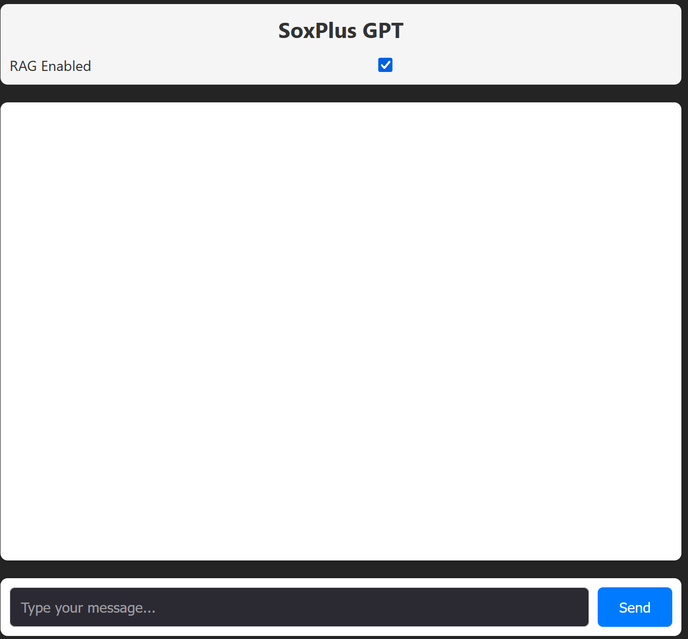

# SOX Plus GPT

## Instructions to run

### Prerequisite software

1. Download latest version of python from [this](https://www.python.org/downloads/) link. If you are unsure about the version pick version 3.12 based on your OS (Windows/Mac)
2. Download latest LTS version of nodejs from [this](https://nodejs.org/en) link. Click the button that reads "Download Node.js (LTS)"
3. Install Python and NodeJS. Ensure these are installed in C:\Python and C:\Node if you're running windows
4. Add C:\Python\bin and C:\Node to your PATH environment variables
5. Download ollama setup from [this](https://ollama.com/) link. Install it to C:\Ollama directory. Add C:\Ollama to your PATH enviornment variables
6. Download opensearch from [this](https://artifacts.opensearch.org/releases/bundle/opensearch/2.18.0/opensearch-2.18.0-windows-x64.zip) link. Install it to C:\Opensearch

### Setup the stack

1. Follow instructions on [this](https://opensearch.org/docs/latest/install-and-configure/install-opensearch/windows/) page to setup Opensearch
2. To download mistral model using ollama use the following commands one by one:

```shell
ollama pull mistral
ollama run mistral --verbose
```

Note that `ollama pull mistral` command should be done once to download mistral model which is 4GB size.

1. Clone this project to your laptop. I assume you'll clone it to C:\Projects directory. Use following command to clone:

```shell
git clone https://github.com/rkalyankumar77/SoxPlusGPT.git
```

4. Now `cd C:\Projects\SoxPlusGPT` into project directory
5. From `C:\Projects\SoxPlusGPT` directory run the following command. Note that you should have C:\Python in your PATH environment variable:
   ```shell
   pip install -r requirements.txt
   ```
6. Now `cd C:\Projects\SoxPlusGPT\Chatbot` and run the following command. Note that you should have C:\Node in your PATH environment variable:

```shell
npm install
```

Now we are ready to run the stack.

### Run the stack

1. Start Opensearch. `cd C:\Opensearch\bin` and run `opensearch.bat`
2. Start ollama model. Using a powershell or command prompt run the command `ollama run mistral --verbose`
3. Start Python backend server by `cd C:\Projects\SoxPlusGPT` and run the following command:

```shell
uvicorn api:app --reload
```

4. Start React NodeJS Server by `cd C:\Projects\SoxPlusGPT\Chatbot` and run the following command:

```shell
npm run dev
```

Now the application can be accessed using the link: http://localhost:5173 in your browser which should load the following UI:


After this you can start prompting the model and play around with it.

### Training the model with more documents

If you want to add more documents to train the model, copy them into `C:\Projects\SoxPlusGPT\Documents` directory and run the following command from directory `C:\Projects\SoxPlusGPT`:

```shell
python train.py
```

### Note on performance

The chat responses will be terribly slow based on your laptop hardware. If you have got good NVidia GPU, GPU RAM & very high CPU RAM (64GB and above) you will get faster responses.. otherwise, please be patient until you see a response. In my laptop that doesn't have a GPU & having 16GB RAM, the response is taking 4+ minutes.

This slowness will go away if we move our model hosting to cloud and also the vector DB index to cloud service.
